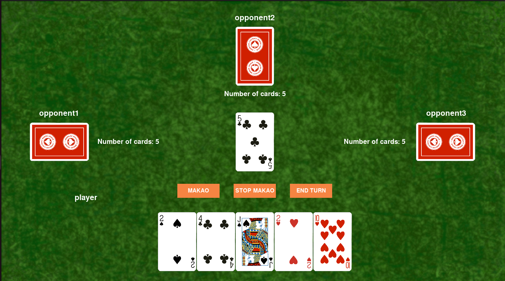

# 🂡 Makao card game


## 📜 Description

"Makao" is a simple card game that allows player to compete against from 1 to 3 computer opponents. Coded in Python, the game features a GUI interface to display playing table and cards.

## 📝 Note

This game was created for "Fundamentals of Programming and Computer Science" course during my first year of studies at Warsaw University of Technology.

## ✅ Requirements

1. **Software requirements**:
The game requires Python 3.11.4 or newer.

2. **Libraries used**:
- pygame 
- time (built-in)
- csv (built-in)
- random (built-in)
- abc (built-in)
- enum (built-in)

## 💾 Installation

1. Clone the repository:
    ```sh
    git clone https://github.com/MaciejCieslik1/Makao.git
    ```
    
2. Navigate to the project **Makao** directory:
    ```sh
    cd Makao/
    ```

3. Run the game:
    ```sh
    python3 -u "main.py"
    ```

## 🎯 Game Preparation

Player can choose the number of computer opponents (1, 2 or 3) and a difficulty level (easy or hard)

## ℹ️ Game Rules

If you would like to read the rules of the game, please click [here](https://en.wikipedia.org/wiki/Macau_(card_game)) to access the game rules.

**Note**: The game is created in it's classical varation, but the jokers are not valid in the game.

## 📁 Project Structure

```bash
ShipsGame/       # Contains all game directiories and files, including main.cpp and makefile
│
├── languages/   # Contains language files 
│
├── saved/       # Stores saved game stat files
│
└── Ships/       # Contains all classes and most of data files
│
└── screenshots/ # screenshots
```

# 🖼️ Screenshots
<p align="left">
  
</p>

## 📜 Licence
This project is licensed under the MIT License. See the [LICENCE](https://github.com/MaciejCieslik1/ShipsGame/blob/master/LICENCE) file for details.

## 📬 Contact
For questions, feedback, or support:
- **Author**: Maciej Cieślik
- **LinkedIn**: [Maciej Cieślik](https://www.linkedin.com/in/maciej-cie%C5%9Blik-1ab60a290/)
- **Instagram**: [@maciek_cieslik](https://www.instagram.com/maciek_cieslik)
- **GitHub**: [MaciejCieslik1](https://github.com/MaciejCieslik1)
- **Support**: Email [maciej.cieslik.official@gmail.com](mailto:maciej.cieslik.official@gmail.com)


